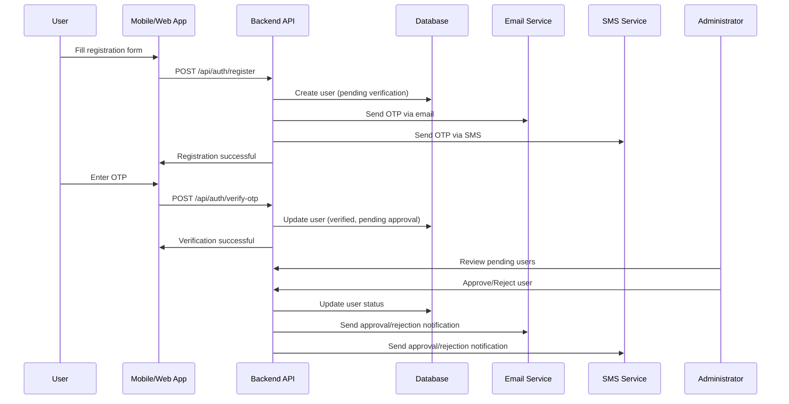

# Community Library App

A comprehensive multi-platform application for community book sharing and management.

## Features

### 🔐 User Registration & Authentication
- **Multi-step Registration**: Personal info, family/community details, security setup
- **Multi-persona Support**: Users can be Publishers, Borrowers, or Administrators
- **OTP Verification**: Email and SMS verification with resend functionality
- **Admin Approval**: Manual review and approval process for new users
- **Secure Authentication**: JWT-based auth with refresh tokens

### 📚 Book Management
- **Book Publishing**: Scan barcodes to add books to the library
- **Book Discovery**: Search and browse available books
- **Rental System**: Request and manage book rentals
- **Digital Wallet**: Track balances and automated fine calculations

### 👥 User Personas
1. **Publisher (Lender)**: Individuals who lend books to the community
2. **Borrower**: Users who borrow books from publishers
3. **Administrator**: System managers who approve users and oversee operations

### 📱 Multi-Platform Support
- **Mobile App**: React Native for iOS and Android
- **Web Application**: Responsive React.js web app
- **Admin Dashboard**: Comprehensive user and system management

## 🎯 Overview

Community Library enables users to lend and borrow books within their community through three main personas:
- **Publishers (Lenders)**: Add books via barcode scanning, manage lending
- **Borrowers**: Discover and borrow books, manage digital wallet
- **Administrators**: Approve books, manage users, oversee transactions

## 🏗️ Architecture

```
Community Library Project/
├── mobile/                 # React Native mobile app
│   ├── src/
│   │   ├── components/     # Shared mobile components
│   │   ├── screens/        # Mobile screens
│   │   │   ├── RegisterScreen.js
│   │   │   ├── OTPVerificationScreen.js
│   │   │   └── ApprovalPendingScreen.js
│   │   ├── navigation/     # Navigation setup
│   │   └── utils/          # Mobile utilities
│   ├── package.json
│   └── README.md
├── web/                    # React.js web application
│   ├── src/
│   │   ├── components/     # Shared web components
│   │   ├── pages/          # Web pages
│   │   │   ├── RegisterPage.js
│   │   │   ├── OTPVerificationPage.js
│   │   │   ├── ApprovalPendingPage.js
│   │   │   └── AdminDashboard.js
│   │   ├── hooks/          # Custom hooks
│   │   └── utils/          # Web utilities
│   ├── package.json
│   └── README.md
├── backend/                # Node.js/Express API server
│   ├── src/
│   │   ├── models/         # Database models
│   │   │   ├── User.js     # User schema with verification & approval
│   │   │   └── OTP.js      # OTP management schema
│   │   ├── routes/         # API routes
│   │   │   ├── auth.js     # Authentication endpoints
│   │   │   └── admin.js    # Admin management endpoints
│   │   ├── middleware/     # Custom middleware
│   │   │   └── auth.js     # JWT & role-based authorization
│   │   ├── services/       # Business logic services
│   │   │   ├── authService.js    # Registration, OTP, login logic
│   │   │   ├── emailService.js   # Email notifications
│   │   │   ├── smsService.js     # SMS notifications
│   │   │   └── adminService.js   # User management
│   │   └── utils/          # Backend utilities
│   ├── package.json
│   └── README.md
├── shared/                 # Shared code and utilities
│   ├── components/         # Cross-platform components
│   ├── types/              # TypeScript definitions
│   ├── utils/              # Shared utilities
│   └── validations/        # Validation schemas
└── docs/                   # Documentation
    ├── api/                # API documentation
    ├── deployment/         # Deployment guides
    └── architecture/       # Architecture diagrams
```

## ✨ Features

### Core Features
- 📱 **Cross-Platform**: Native mobile apps + responsive web
- 🔐 **Authentication**: Email/phone registration with OTP verification and admin approval
- 📚 **Book Management**: Barcode scanning for easy book publishing
- 🔍 **Discovery**: Search and filter books by location, genre, availability
- 💳 **Digital Wallet**: Manage balance, payments, and automated fines
- 👨‍💼 **Admin Dashboard**: User management, book approvals, transaction oversight

### Registration & Verification Flow
1. **Multi-step Registration**: Personal, family/community, and security information
2. **Dual Verification**: Email and SMS OTP verification with resend capability
3. **Admin Approval Process**: Manual review by administrators before account activation
4. **Status Tracking**: Real-time progress indication for users

### User Management Features
- **Role-based Access**: Publisher, Borrower, Administrator personas
- **Account States**: Pending, Approved, Rejected, Blocked status management
- **Admin Dashboard**: Comprehensive user approval and management interface
- **Notification System**: Email and SMS notifications for status changes

### Technical Features
- 🔄 **Real-time Updates**: Socket.io for live notifications
- 📊 **Analytics**: User engagement and book popularity tracking
- 🔒 **Security**: JWT authentication, data encryption, input validation
- 💰 **Payments**: Stripe integration for wallet transactions
- 📧 **Notifications**: Email and SMS via Nodemailer/Twilio
- 📱 **PWA Support**: Offline capabilities for web app

## 🔐 Authentication Flow

### User Registration Process


### Admin Approval Dashboard
- **Pending Users**: List of users awaiting approval with detailed information
- **User Management**: Approve, reject, block, or unblock users
- **Dashboard Statistics**: Total users, pending approvals, registration trends
- **Batch Operations**: Manage multiple users simultaneously

## 📱 Mobile App Features

### Registration Screens
- **Step 1**: Personal Information (name, email, phone)
- **Step 2**: Family & Community (parent name, community)
- **Step 3**: Security & Role (password, persona selection)

### OTP Verification
- **Dual Method**: Email and SMS verification options
- **Auto-resend**: Automatic OTP resend with countdown timer
- **Method Switching**: Toggle between email and SMS verification
- **Input Validation**: Real-time OTP format validation

### Approval Status
- **Progress Tracking**: Visual indication of registration progress
- **Timeline**: Expected approval timeline with status updates
- **Support Access**: Direct contact to support team

## 🌐 Web Application Features

### Admin Dashboard
- **User Overview**: Comprehensive user statistics and metrics
- **Pending Approvals**: Table view of users awaiting approval
- **User Details**: Detailed user information modal
- **Action Management**: Approve, reject, block operations with confirmation
- **Search & Filter**: Find users by status, role, registration date

### Registration Flow
- **Responsive Design**: Mobile-first design for all screen sizes
- **Form Validation**: Real-time validation with clear error messages
- **Multi-step Process**: Clean step-by-step registration flow
- **Accessibility**: WCAG compliant with keyboard navigation

## 🚀 Quick Start

### Prerequisites
- Node.js 18+ and npm
- MongoDB (local or cloud)
- Expo CLI for mobile development
- Git

### Installation

1. **Clone the repository**
   ```bash
   git clone <repository-url>
   cd community-library
   ```

2. **Install dependencies**
   ```bash
   npm run install:all
   ```

3. **Set up environment variables**
   ```bash
   # Backend
   cp backend/.env.example backend/.env
   # Edit backend/.env with your configuration
   
   # Web
   cp web/.env.example web/.env
   # Edit web/.env with your configuration
   ```

4. **Start development servers**
   ```bash
   # Terminal 1 - Backend API
   npm run dev:backend
   
   # Terminal 2 - Web App
   npm run dev:web
   
   # Terminal 3 - Mobile App
   npm run dev:mobile
   ```

### Development URLs
- **Backend API**: http://localhost:5000
- **Web App**: http://localhost:3000
- **Mobile App**: Expo DevTools will open automatically

## 📱 Mobile Development

The mobile app uses Expo for cross-platform development:

```bash
cd mobile
npx expo start

# Run on specific platforms
npx expo start --android
npx expo start --ios
```

## 🌐 Web Development

The web app is a React.js application with Material-UI:

```bash
cd web
npm start
```

## 🔧 Backend Development

The backend is a Node.js/Express API with MongoDB:

```bash
cd backend
npm run dev
```

## 📁 Project Structure

### Backend (`/backend`)
```
backend/
├── src/
│   ├── controllers/     # Request handlers
│   ├── models/         # Database models
│   ├── routes/         # API routes
│   ├── middleware/     # Custom middleware
│   ├── services/       # Business logic
│   ├── utils/          # Helper functions
│   └── server.js       # App entry point
├── tests/              # Test files
└── uploads/            # File uploads
```

### Web App (`/web`)
```
web/
├── public/             # Static assets
├── src/
│   ├── components/     # Reusable components
│   ├── pages/          # Page components
│   ├── hooks/          # Custom React hooks
│   ├── services/       # API services
│   ├── contexts/       # React contexts
│   ├── utils/          # Helper functions
│   └── App.js          # App entry point
└── build/              # Production build
```

### Mobile App (`/mobile`)
```
mobile/
├── src/
│   ├── components/     # Reusable components
│   ├── screens/        # Screen components
│   ├── navigation/     # Navigation config
│   ├── services/       # API services
│   ├── hooks/          # Custom hooks
│   ├── contexts/       # React contexts
│   └── utils/          # Helper functions
├── assets/             # Images, fonts, etc.
└── App.js              # App entry point
```

### Shared (`/shared`)
```
shared/
├── src/
│   ├── validation/     # Validation schemas
│   ├── utils/          # Common utilities
│   ├── constants/      # App constants
│   └── types/          # TypeScript types
└── index.js            # Exports
```

## 🔐 Environment Variables

### Backend (.env)
```
MONGODB_URI=mongodb://localhost:27017/community-library
JWT_SECRET=your-jwt-secret
STRIPE_SECRET_KEY=sk_test_...
TWILIO_AUTH_TOKEN=your-twilio-token
EMAIL_PASS=your-email-password
```

### Web (.env)
```
REACT_APP_API_URL=http://localhost:5000/api
REACT_APP_STRIPE_PUBLISHABLE_KEY=pk_test_...
```

## 🧪 Testing

```bash
# Run all tests
npm test

# Run tests for specific workspace
npm run test --workspace=backend
npm run test --workspace=web
npm run test --workspace=mobile
```

## 🚀 Deployment

### Backend (Node.js)
- Deploy to Heroku, Railway, or similar
- Set environment variables
- Configure MongoDB Atlas

### Web App
- Build: `npm run build:web`
- Deploy to Vercel, Netlify, or similar
- Configure environment variables

### Mobile App
- Build: `npx expo build:android` / `npx expo build:ios`
- Deploy to Google Play Store / Apple App Store

## 📚 API Documentation

### Authentication Endpoints
- `POST /api/auth/register` - User registration
- `POST /api/auth/login` - User login
- `POST /api/auth/verify-otp` - OTP verification
- `POST /api/auth/refresh` - Refresh token

### Book Endpoints
- `GET /api/books` - List books
- `POST /api/books` - Create book
- `PUT /api/books/:id` - Update book
- `DELETE /api/books/:id` - Delete book

### User Endpoints
- `GET /api/users/profile` - Get user profile
- `PUT /api/users/profile` - Update profile
- `GET /api/users/wallet` - Get wallet balance

### Transaction Endpoints
- `POST /api/transactions/borrow` - Borrow book
- `POST /api/transactions/return` - Return book
- `GET /api/transactions/history` - Transaction history

## 🤝 Contributing

1. Fork the repository
2. Create a feature branch
3. Make your changes
4. Add tests
5. Submit a pull request

## 📄 License

This project is licensed under the MIT License - see the [LICENSE](LICENSE) file for details.

## 📞 Support

For questions or support, please open an issue on GitHub or contact the development team.

---

**Community Library Team** 📚
